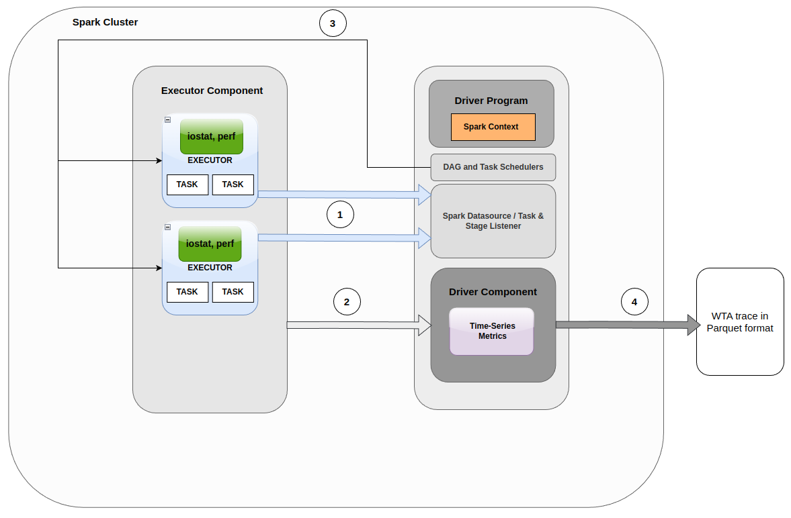

# Spark Adapter Layer

## Overview



The Spark Adapter is responsible for parsing Spark execution information into WTA objects.
The diagram above illustrates the workflow of the adapter.

- **Label 1:** Heartbeat sent by the executor to the driver every 10 seconds to send metrics.
  These are intercepted by the `SparkListenerAPI`.
- **Label 2:** RPC messages sent using the `SparkPluginAPI` for executors to communicate
  any additional information to the driver-side of the plugin.
- **Label 3:** At each stage, the task scheduler gets sets of tasks from the DAG and the task scheduler
  sends the tasks to each executor.
- **Label 4:** Once the job has ended, all objects will be serialised into parquet format.

By leveraging the architecture discussed above, the transmission of data across various stages within the plugin can be discussed in further detail.
The SparkListenerInterface is used to gather Task and Job level data, while additional resource utilization metrics are acquired at the executor level.
These metrics are then transmitted periodically to the driver using the Spark Plugin API.


To address the limitation of excessive memory consumption, it is impractical to store all this information solely in the driver's memory.
As a solution, serialization and deserialization techniques are applied.
The rate of serialization is configurable by the user.
Upon completion of the application, all of the data is ultimately outputted to Parquet format.


## Installation and Usage
1.  Clone the repository
2.  Optional (if more I/O metrics are needed):
   - Install the sysstat package by running the following command in the terminal:
     ```shell
     sudo apt install sysstat
     ```

   - Install the dstat package by running the following command in the terminal:
    ```shell
    sudo apt install dstat
    ```

3.  To allow advanced performance metrics to be gathered, you can opt to make the `perf` utility available.
    To do this, you need to do the following:

    On Ubuntu:

    ```shell
    apt-get install linux-tools-common
    apt-get install linux-tools-generic
    apt-get install linux-tools-`uname -r`
    ```

    On Debian:

    ```shell
    apt-get install linux-perf
    ```

    On CentOS / RHEL:

    ```shell
    yum install perf
    ```

    Followed by setting `perf_event_paranoid` to 0:

    ```shell
    sysctl -w kernel.perf_event_paranoid=0
    ```

    It is important to note that the installed version of `perf` must be compatible with the kernel. Especially for containerised environments, this could be an issue.

There are two ways to make use of the plugin
1. Integrate the plugin into the Spark application source code
2. Create the plugin as a JAR and run alongside the main Spark application via **spark-submit**

Note that for either approaches, `sparkContext.stop()` must be specified at the end of the main Java application to invoke the plugin's application finished callback. Otherwise, the plugin doesn't end properly.

### Plugin Integration
For the first approach, create a `SparkConf` object and set the following config:

```java
conf.set("spark.plugins", "com.asml.apa.wta.spark.WtaPlugin");
conf.set("spark.driver.extraJavaOptions", "-DconfigFile=<config.json_location>");
```
The first line registers the main plugin class within the Spark session. The second line sets the config filepath value to the *spark.driver.extraJavaOptions* key for the driver component to access.

### CLI Execution
For the second approach, create a JAR file of the plugin and run it alongside the main Spark application using
**spark-submit**. Here is an example of how to run the plugin alongside the main Spark application:

- Run `mvn -pl core clean install && mvn -pl adapter/spark clean package` in the source root.
- Copy the resulting jar file from `adapter/spark/target`.
- Execute the following command in the directory where the jar file is located:

```shell
spark-submit --class <main class path to spark application> --master local \
--conf spark.plugins=com.asml.apa.wta.spark.WtaPlugin \
--conf spark.driver.extraJavaOptions=-DconfigFile=<config.json_location> \
--jars <plugin_jar_location> <Spark_jar_location> \
<optional arguments for spark application>
```
- The Parquet files should now be located in the `outputPath` as specified in the config file.

#### Additional Java Options
- If the user wants to specify additional java options within a `--conf` flag of `spark-submit`, use the following format:

  ```shell
   --conf "spark.driver.extraJavaOptions=-DconfigFile=<config.json_location> -Dlog4j.rootCategory=TRACE,console" \
  ```
  - The arguments have to be seperated with `-D` as shown above, where the config location is always the first argument.

Note: this way, the plugin will be compiled for Scala 2.12. If you want to compile for a Scala 2.13 version of Spark,
you will need to set the `spark.scala.version` flag to 2.13, such as in
`mvn -pl adapter/spark -Dspark.scala.version=2.13 clean package`.

### Integration with PySpark
PySpark is the Python API for Apache Spark and the plugin can also be used with Python scripts that make use of PySpark.

For Spark 3.2.4, a Python version between 3.7 to 3.10 needs to be installed. In addition, add the following environment variables in your `.bashrc` file (adjust the version accordingly):

```
export PYSPARK_PYTHON=/usr/bin/python3.10
export PYSPARK_DRIVER_PYTHON=/usr/bin/python3.10
```

After specifying the above environment variables, adjust your Spark configuration as follows:

```Python
from pyspark import SparkConf, SparkContext

conf = SparkConf().setAppName("MyApp").set("spark.plugins", "com.asml.apa.wta.spark.WtaPlugin").set("spark.driver.extraJavaOptions", "-DconfigFile=/home/user/sp_resources/config.json")
sc = SparkContext(conf=conf)

...

sc.stop()
```

Note that in the Python script, `sc.stop()` must also be specified at the end to invoke the plugin's application finished callback.

Now execute the following command and submit the Python script along with the JAR file of the plugin to **spark-submit**.

```shell
spark-submit --jars <path-to-plugin-jar> <path-to-python-script>
```

Another way to specify the plugin config is to use the `--conf` flag in the command line directly:

```shell
spark-submit --conf spark.plugins=com.asml.apa.wta.spark.WtaPlugin --conf spark.driver.extraJavaOptions=-DconfigFile=<path-to-config-file> --jars <path-to-plugin-jar> <path-to-python-script>
```

## Configuration
General configuration instructions are located [here](/../../README.md#configuration). See above for [instructions](#installation-and-usage) on how to provide the configuration to the plugin.


## Description
This plugin will **not** block the main Spark application. Even if the plugin fails to initialise, the main Spark
application will still run.

The Spark Adapter consists of two main parts that allows the application to collect metrics.
- SparkListenerInterface
- SparkPlugin API

This module listens to events from the Spark job that is being carrying out. It retrieves metrics and subsequently aggregates it to different WTA objects. The metrics are then stored in a parquet file.

### SparkListenerInterface

The SparkListenerInterface listens to the Spark events and collects the metrics. As part of the
standard instrumentation of Spark, metrics are transmitted from the executor to the driver as part of a heartbeat. The listener interface
intercepts these events. Examples of how we use it, and what metrics we collect for the different WTA objects can be seen [here](/src/main/java/com/asml/apa/wta/spark/listener).
The heartbeat interval can be modified by modifying `spark.executor.heartbeatInterval`
> ExecutorMetrics are updated as part of heartbeat processes scheduled for the executors and for the driver at regular intervals: spark.executor.heartbeatInterval (default value is 10 seconds)

More information can be found [here](https://spark.apache.org/docs/latest/monitoring.html)

It also allows us to define custom behaviour when certain events are intercepted, such as tracking the various stage ids for a Spark job.

```java
@Override
public void onJobStart(SparkListenerJobStart jobStart) {
    jobStart.stageInfos().foreach(stageInfo -> stageIdsToJobs.put(stageInfo.stageId(), jobStart.jobId()));
}
```

### Spark Plugin API
We also use the Spark Plugin API to connect our plugin to the Spark job. The plugin consists of two components: The driver plugin and the executor plugin.
An instance of the `DriverPlugin` is created for the driver, it's lifecycle is equivalent to that of the Spark application. An instance of `ExecutorPlugin` gets instantiated
for each executor, and it's lifecycle is equivalent to that of an executor. This can possibly span multiple tasks.

Our main use case for the plugin API is to pass messages between the executor and the driver. We use different libraries such as `iostat` to collect resource
utilisation metrics on the executor side. These metrics are then passed to the driver using the plugin API. Namely, we use `ask()`,`send(Object message)` and `receive(Object message)`.

Aggregation of all the resource utilisation metrics are done at the driver's end.

## Developer Guidelines

### General Remarks
- The WTA format uses ids in `INT64` format. The Spark API provides some ids (such as `executorID`) in string format. To convert this, we use `Math.abs(id.hashCode())`.
- All timestamps are in Unix epoch millis.
- When a resource is not needed anymore, release it in `shutdown()`, within the respective `PluginContext`.

### Known Limitations

#### Utilisation of the plugin on Windows
- We don't recommend using the plugin on Windows, although it is possible.
- The plugin is compatible with Windows; however, the collection of resource utilization metrics is limited.
    - This limitation arises because the plugin relies on dependencies that are only available on UNIX-based systems.
- Logs will be generated indicating that certain resource utilization metrics cannot be collected.
  - This can potentially cause performance issues if the resource ping interval is small since the plugin will write to the log each time a non-available resource is pinged. I/O operations can be expensive.
- It is highly recommended to set the `resourcePingInterval` to 2000 and `executorSynchornizationInterval` to 1000.

#### Stage Level Metrics
- Stage level metrics are only outputted in the trace if they are submitted and successfully completed. The scheduler sometimes creates stages which are later skipped or removed.
- Stage level metrics are very sparse, this is a limitation with the Spark API itself.

#### Task-Level Resource metrics
- This is a big area of improvement for the plugin. Due to the limitations of the Spark API, we are not able to easily isolate resource level metrics (such as disk IO time), to specific tasks. We have had to make several compromises
  - Fields such as `energyConsumption`, relate to the energy consumption of the entire executor (during the lifespan of the task) and not the task itself.
  - TaskState information is not accurate. Data analysis on this object can produce inaccurate results.

#### Interaction between the SparkListenerInterface and the Spark Plugin API
- The SparkListenerInterface and the Spark Plugin API are two separate components. Using certain lifecycle callbacks such as `onTaskEnd` and `onTaskSucceeded` can cause issues if they are used whilst depending on one another.
  - An example of this is trying to aggregate task-level metrics on the driver with `onTaskEnd`, whilst sending them from the executor to the driver using `onTaskSucceeded`
- The SparkListenerInterface is not guaranteed to be called in the same order as the Spark Plugin API. This is because the SparkListenerInterface is called asynchronously, whereas the Spark Plugin API is called synchronously.
  - This can cause issues when trying to aggregate task-level metrics on the driver. For example, if the SparkListenerInterface is called before the Spark Plugin API, then the driver will not have the task-level metrics to aggregate.
  - This can also cause issues when trying to send task-level metrics from the executor to the driver. For example, if the Spark Plugin API is called before the SparkListenerInterface, then the executor will not have the task-level metrics to send.
- Certain lifecycle callbacks in the SparkListenerInterface do **NOT** suppress exceptions, whilst the Spark Plugin API does.

#### Memory
- As we gather an enormous amount of data to create the traces, we write a lot of data to disk. This is done to avoid everything from piling up in memory and causing `OutOfMemoryExceptions`. This constant writing to and reading from disk causes some overhead.
  - As we perform these operations in the listeners, this could theoretically cause Spark's listener queue to fill up on very intensive jobs which produce a lot of small tasks. To avoid issues with this, it is recommended to increase the queue size for such very intensive workloads.
  - Decreasing the size of the queue is warned against as it can cause such issues to come up where they are not expected to.

## Metric Calculation Clarification
For some metrics, it is not immediately clear how they are calculated. This section aims to clarify this.


### Resource

### ResourceState
#### availableDiskIoBandwidth
- To calculate the available Disk I/O bandwidth, we rely on some metrics provided by `iostat -d`. We consider `kB_read/s` and `kb_wrtb/s` across all block partitions. We convert it to Gbps and then sum it in the following way.
```java
if (ping.getIostatDto().isPresent()) {
    final IostatDto iostatDto = ping.getIostatDto().get();
    availableDiskIoBandwith = iostatDto.getKiloByteReadPerSec() / kBpsToGbpsDenom
        + iostatDto.getKiloByteWrtnPerSec() / kBpsToGbpsDenom;
}
```
This snippet can be found [here](src/main/java/com/asml/apa/wta/spark/streams/MetricStreamingEngine.java)

#### averageUtilizationXMinute
- By using the information provided by `cat /proc/loadavg`, we can obtain the average utilization of the CPU over the last X minutes, as mentioned [here](https://access.redhat.com/documentation/en-us/red_hat_enterprise_linux/4/html/reference_guide/s2-proc-loadavg).
- We also consider the number of cores available on the executor, which is provided by the Spark API, this calculation is inspired from the following [source](https://superuser.com/questions/1402079/linux-understanding-load-average-and-cpu).
```java
final double averageUtilization1Minute = ping.getProcDto()
        .flatMap(ProcDto::getLoadAvgOneMinute)
        .map(loadAvg -> loadAvg / numCores)
        .orElse(-1.0);
```

This snippet can be found [here](src/main/java/com/asml/apa/wta/spark/streams/MetricStreamingEngine.java)

## Benchmarking
[The benchmarking module](../../submodules/benchmarking/README.md) is used to benchmark the performance of the plugin. Any changes to the plugin should be benchmarked to ensure no significant performance degradation.

It is important to note that the benchmarking module is not part of the plugin itself but a separate tool.

## Logging
The plugin uses the [SLF4J](http://www.slf4j.org/) logging API. This allows the end-user to choose the desired logging frameworks (e.g. java.util.logging, logback, log4j) . The plugin itself does not depend on any logging implementation.
The plugin log level corresponds to the Spark log level. This means that the plugin log level can be configured using the Spark configuration through the following:
```java
sc.setLogLevel("INFO");
```
